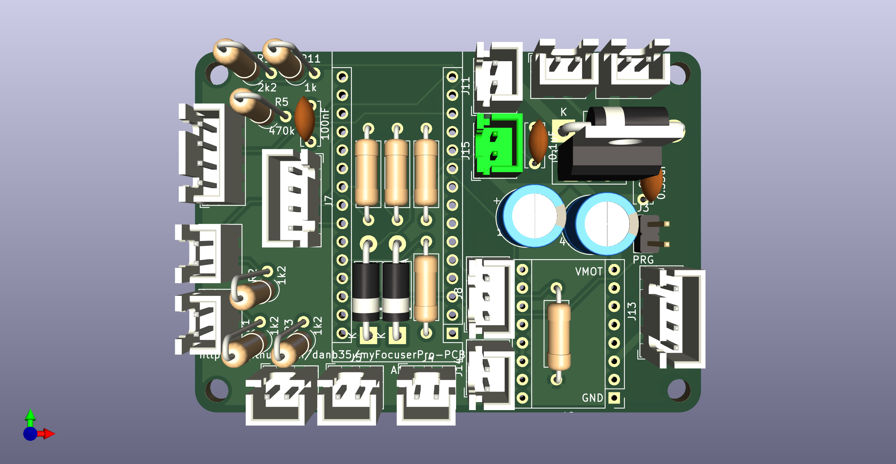

# myFocuserPro-PCB
 KiCad schematic and board for myFocuserPro2: https://sourceforge.net/projects/arduinofocuscontrollerpro/

# Introduction
myFocuserPro is a DIY, Arduino-based focuser designed for use with telescopes.  The design, source code, schematics, PCB files (Gerbers), and extensive documentation are available at the link above.  So what am I doing in this repo?

Unfortunately, the Gerbers there have a few issues, most notably that the footprint for the reverse-polarity protection diode (D1 on the schematic) just doesn't fit the specified diode.  The specified "fix" for the problem is to file down the leads of the diode until they fit through the holes.  And while this should be a trivial thing to fix, editable source files for the schematic and board haven't been released.

To address this, I re-drew the schematic and PCB layout in KiCad 6.0.  [KiCad](https://www.kicad.org/) is free, open source electronics design software, so you can download it to edit these files as desired.

# Design changes
This schematic is identical to the M-MT-F-BT DRV8825-HW203 variation at SourceForge, as that's the recommended version for new builds.  I intend (and hope) that the schematic will be easier to read and follow, but there should not be any changes in the components or how they're connected.  I don't intend to do this for any other variations of the schematic.  Most of the reference designators (i.e., R3, C2, etc.) are identical, but KiCad has changed some of the semiconductors.  But I've made a few changes to the board layout.

First, of course, there's the change that drove the whole redesign--the footprint for D1 now actually fits the specified diode.  I've also replaced most of the places where pin headers had been used for off-board connections (e.g., for the stepper, the pushbuttons, the display, etc.) and replaced them with JST-XH connectors.  These provide some friction to prevent connections from coming loose inadvertently, and also polarize the connections (so, e.g., you can't plug in a LED backward).  The only exception to this is J3, the programming "switch."  I intend that this will be a jumper, not an externally accessible switch.

While the board size is similar to the original, it is not identical, and it will not fit in the 3D-printed case design that's posted on SourceForge.  As time permits, I'll try to prepare a case design that will work with this.

# Board Images

# Ordering
I don't sell these boards; you can have them made by any PCB fab you choose.  To do so, simply download Gerber/myFocuserPro.zip from this repo, upload it to your fab of choice, and have at it.  If you don't have a fab of choice, consider the two linked below, in which I have no financial interest (i.e., I'm not an affiliate, partner, or anything else; I don't make anything from your purchase of these boards--I'm just a customer of both services).

## OSHPark
OSHPark are an American company known for high-quality boards.  They'll produce three copies of your design for $5 per square inch, in purple, with gold plating.  This cost is often higher than the Chinese fabs, but they don't charge shipping, and you don't have to wait for shipping for China.  This board costs about $27 shipped for three copies as of this writing.  You can order boards using this link:
https://oshpark.com/profiles/danb35

## JLCPCB
[JLCPCB](https://jlcpcb.com/) are a Chinese PCB fab that I've been pretty happy with.  Their prices are low (starting at $2/5 boards), they produce the boards quickly, and they ship quickly via DHL.  The biggest drawback is the cost of shipping--at this writing, five boards will cost you $2, but the shipping is another $20 or more.
